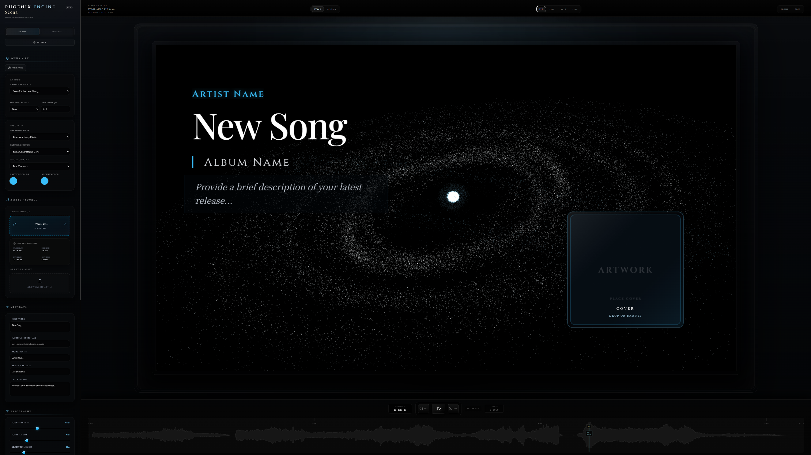
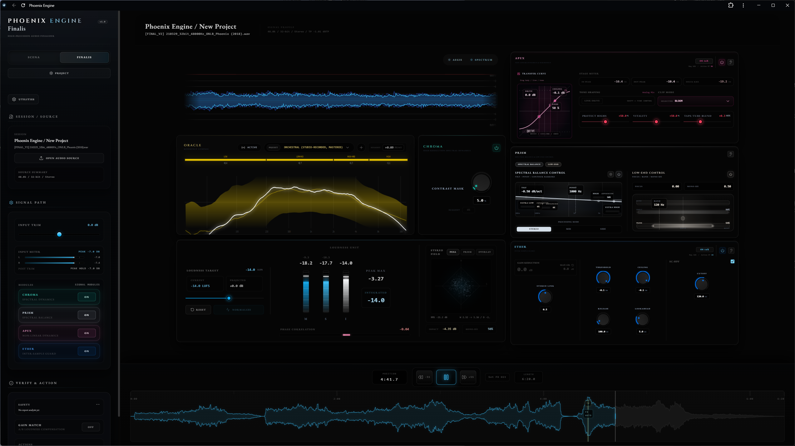

# Phoenix Engine

  

Phoenix Engine is a browser-based creative tool for motion artwork and precision audio finishing.

Initial public release: **June 8, 2026 (JST)**

Current documented version: **Phoenix Engine v1.1.0 (unreleased)**

Official site: <https://phxengine.static.jp/>

Created by **Teruyuki Shiraiwa / 白岩晃行**.  
Creator website: <https://teruyukishiraiwa.art/>  
Contact: See [Support](./SUPPORT.md).

Phoenix Engine originated from the creative context of **"Phoenix"**, a musical work by Teruyuki Shiraiwa.

## Product Surfaces

Phoenix Engine v1.1 consists of two integrated surfaces:

- **Scena**: motion artwork, visual scene design, preview, and video export.
- **Finalis**: local audio mastering, metering, reference comparison, WAV export, and final export analysis.

### Scena

### Finalis

## Repository Purpose

This repository is for public documentation, release notes, support information, issue tracking, and third-party license/source notices.

Phoenix Engine is proprietary software. Application source code is not published in this repository.

## Public Documentation

- [About Phoenix Engine](./docs/about.md)
- [Architecture Overview](./docs/architecture-overview.md)
- [Finalis Technical Overview](./docs/finalis-technical-overview.md)
- [Scena Technical Overview](./docs/scena-technical-overview.md)
- [Release Notes](./docs/release-notes.md)
- [Browser Support](./docs/browser-support.md)
- [Export Guide](./docs/export-guide.md)
- [Known Issues](./docs/known-issues.md)
- [FFmpeg Source Information](./FFMPEG_SOURCE.md)
- [Third-Party Notices](./THIRD_PARTY_NOTICES.md)

## Privacy and Local Processing

Phoenix Engine is designed to run in the browser. Local audio files are imported by the user and processed locally in the browser runtime.

Analytics through Google Analytics 4 and Microsoft Clarity is loaded only after consent. Phoenix Engine does not intentionally send audio, artwork, project data, file names, analysis results, or local file paths to these analytics services.

Phoenix Engine v1.1 does not provide YouTube URL analysis and does not call the previously audited Cobalt third-party API.

## FFmpeg Runtime

Phoenix Engine distributes a fixed-source FFmpeg WebAssembly runtime for browser video muxing and CPU fallback export. Runtime hashes and source information are documented in [FFMPEG_SOURCE.md](./FFMPEG_SOURCE.md).

## License

Phoenix Engine application source code and brand assets are not licensed for reuse through this repository. See [LICENSE](./LICENSE).

Third-party components retain their own licenses. See [THIRD_PARTY_NOTICES.md](./THIRD_PARTY_NOTICES.md).
